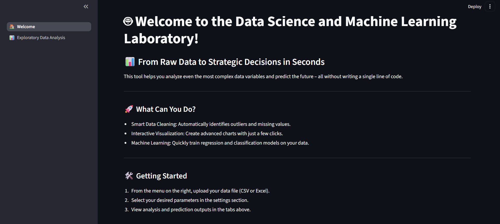

# Data Science Laboratory

**Data Science Laboratory** is an interactive platform for experimenting with data analysis, machine learning, and model interpretability workflows through a user-friendly web interface built with **Streamlit**.

The purpose of this project is to provide a unified environment where users can move through the core stages of a real-world data science workflow — from **data exploration and preprocessing** to **model training, evaluation, comparison, and interpretability** — all in one place.

<p align="center">
  
</p>

> ⚠️ **Project Status**  
> This project is currently under active development and is continuously evolving with new features and improvements.

---

## 🚀 Project Overview

`Data Science Laboratory` is designed as a practical experimentation environment for data science and machine learning tasks.  
It aims to simulate a simplified but realistic **ML workflow laboratory**, allowing users to interactively work with datasets, build models, evaluate results, and explore interpretability techniques.

The application is especially useful for:

- Learning and practicing data science workflows
- Rapid experimentation with machine learning models
- Comparing model performance in an interactive environment
- Understanding preprocessing and pipeline design
- Exploring explainability tools such as SHAP

All core functionalities are accessible through a **Streamlit-based dashboard**.

---

## ✨ Current Features

The project currently includes the following capabilities:

- ✅ **Exploratory Data Analysis (EDA)**
- ✅ **Interactive data visualization**
- ✅ **Data preprocessing tools**
  - Encoding
  - Scaling
  - Imputation
- ✅ **Machine learning model training**
- ✅ **Support for both classification and regression tasks**
- ✅ **Model evaluation**
- ✅ **Machine learning pipeline creation**
- ✅ **Hyperparameter configuration through the UI**
- ✅ **Model performance comparison**
- ✅ **Model interpretability using SHAP**
- ✅ **Interactive web interface with Streamlit**

---

## 🧩 Planned Features

The following features are planned for future development:

- 🚧 **Feature Selection**
- 🚧 **Advanced Hyperparameter Tuning**
- 🚧 **Experiment Tracking with Weights & Biases (W&B)**
- 🚧 **Automatic report generation**
- 🚧 **Model serving with FastAPI**
- 🚧 **Dockerization for easier deployment**
- 🚧 **Deployment optimization utilities**
- 🚧 **Extended Explainable AI modules**
- 🚧 **Advanced model comparison dashboard**

---

## 🛠️ Tech Stack

This project is built using the following technologies and libraries:

- **Python**
- **Streamlit**
- **Pandas**
- **NumPy**
- **Scikit-learn**
- **Plotly**
- **Matplotlib**
- **Seaborn**
- **SHAP**
- **Weights & Biases (W&B)** *(planned feature)*
- **FastAPI** *(planned feature)*
- **Docker** *(planned feature)*

---

## ⚙️ Installation

Clone the repository:
```bash
git clone https://github.com/HosseinHeydari2004/Data-Science-Laboratory.git
cd Data-Science-Laboratory


Create a virtual environment (recommended):

``` bash
python -m venv venv
```

Activate environment:

**Windows**

``` bash
venv\Scripts\activate
```

**Linux / Mac**

``` bash
source venv/bin/activate
```

Install dependencies:

``` bash
pip install -r requirements.txt
```

------------------------------------------------------------------------

## ▶️ Running the Application

Launch the Streamlit app:

``` bash
streamlit run app.py
```

The application will automatically open in your browser.

------------------------------------------------------------------------

## 📁 Project Structure

    Data-Science-Laboratory
    │
    ├── components/        # Main Streamlit components
    ├── pages/             # Streamlit multi-page modules
    ├── datasets/          # Sample datasets
    ├── models/            # Machine learning models
    ├── utils/             # Helper functions and utilities
    ├── requirements.txt
    └── README.md


------------------------------------------------------------------------

## 🎯 Project Vision

This repository is intended to grow into a **complete data science experimentation platform** that brings together:

- Data Analysis
- Data Preprocessing
- Machine Learning
- Model Evaluation
- Model Comparison
- Explainable AI
- Interactive Deployment

The long-term goal is to create a practical environment that reflects parts of real-world **data science** and **machine learning workflows**, while also serving as a learning and experimentation platform.


------------------------------------------------------------------------

## 📌 Roadmap

- [ ] Feature selection tools
- [ ] Hyperparameter tuning module
- [ ] Experiment tracking integration with W&B
- [ ] Automated reporting
- [ ] Model serving with FastAPI
- [ ] Docker support
- [ ] Extended explainability features
- [ ] Improved model comparison dashboard

------------------------------------------------------------------------

## 🤝 Contribution

Contributions, suggestions, and feedback are welcome.

If you'd like to contribute:

1. Fork the repository
2. Create a feature branch
3. Commit your changes
4. Open a Pull Request


------------------------------------------------------------------------

## 👨‍💻 Author

**Hossein Heydari**

- GitHub: [Data-Science-Laboratory](https://github.com/HosseinHeydari2004/Data-Science-Laboratory)

---

## 🙏 Thank You

Thank you for taking the time to explore this project. Your interest, feedback, and support are greatly appreciated.
